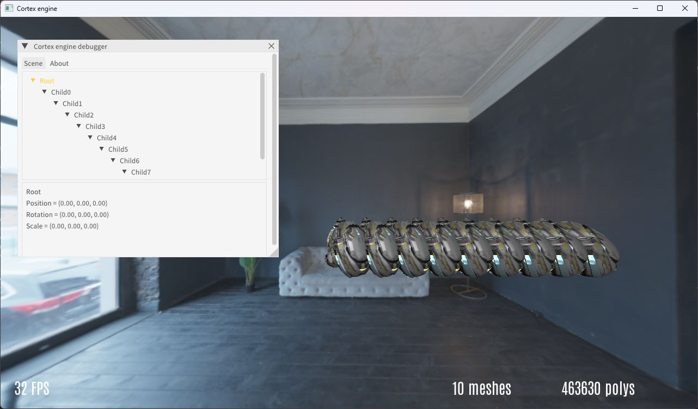

# Simple OpenGL realtime 3D engine

Cortex Engine is a user friendly GPU simple realtime 3D engine using GLSL shaders.

It handles builtin primitives such as plane, sphere, cube, billboard and also model loading (obj, fbx, glTF...)

You can choose between 2 rendering illumination model :
- Blinn Phong (Legacy)
- Physically Based Rendering (aka PBR) (default)

Main features :
- Framebuffer and post processing using GLSL shaders
- Camera
- Lights (omni, spot, directional)
- Shadows (deferred rendering shadow maps using depth buffer)
- Simple animations
- Skybox (cubemap)
- PBR supported textures : Diffuse, Normal, Metalness, Roughness, AmbientOcclusion
- Blinn Phong supported textures : Diffuse, Specular, Normal
- Debug imGUI windows
- Toggle windowed/fullscreen

  

Tech :
- OpenGL
- Glad
- GLFW
- imGUI
- Assimp

